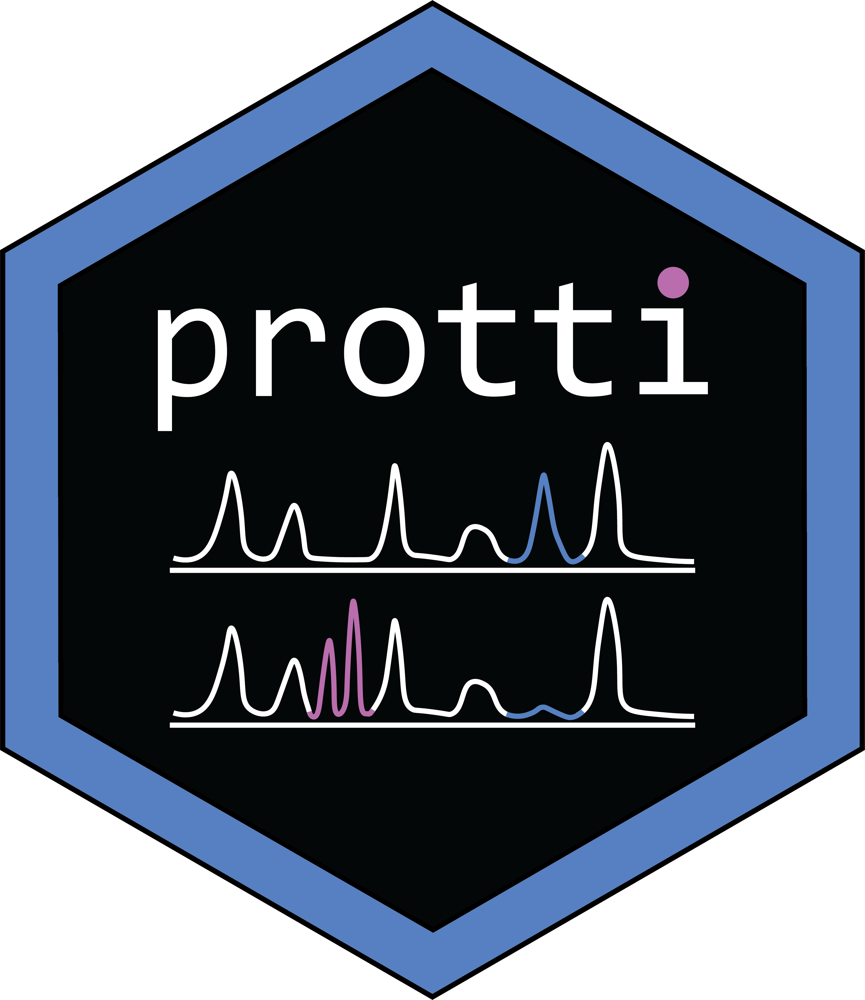

<!-- README.md is generated from README.Rmd. Please edit that file -->

```{r, include = FALSE}
knitr::opts_chunk$set(
  collapse = TRUE,
  comment = "#>",
  fig.path = "man/figures/README-",
  out.width = "100%"
)
```

# protti 

<!-- badges: start -->
<!-- badges: end -->

## Overview

The goal of protti is to provide useful functions for proteomics data analysis. It can be used for DDA, DIA and SRM data. Both limited proteolysis and regular proteomics experiments can be analysed.

## Installation

You can install the development version from [GitHub](https://github.com/) with:

``` r
# install.packages("devtools")
devtools::install_github("jpquast/protti")
```
