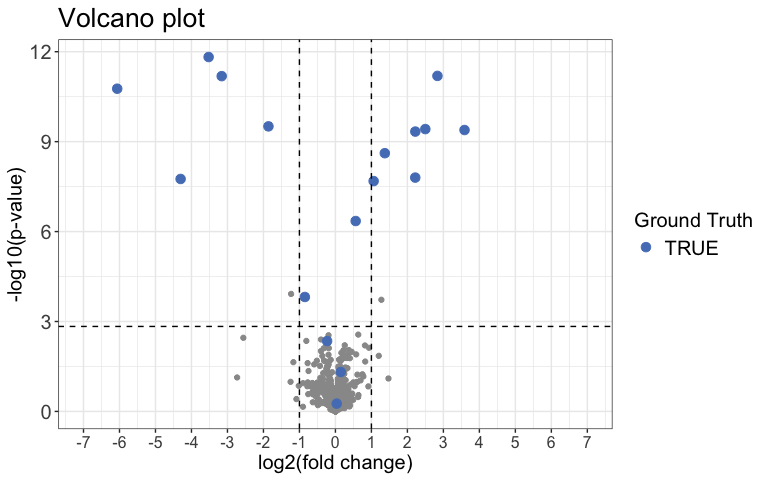

<!-- README.md is generated from README.Rmd. Please edit that file -->

# protti 

<!-- badges: start -->

[](https://github.com/jpquast/protti/actions/workflows/R-CMD-check.yaml)
[](https://app.codecov.io/gh/jpquast/protti?branch=master)
[](https://CRAN.R-project.org/package=protti)
[](https://doi.org/10.1093/bioadv/vbab041)
<!-- badges: end -->

## Overview

The goal of **protti** is to provide flexible functions and workflows
for proteomics quality control and data analysis, within a single,
user-friendly package. It can be used for label-free DDA, DIA and SRM
data generated with search tools and software such as Spectronaut,
MaxQuant, Proteome Discoverer and Skyline. Both limited proteolysis mass
spectrometry (LiP-MS) and regular bottom-up proteomics experiments can
be analysed.

**protti** is developed and maintained by members of the lab of Paola
Picotti at ETH Zurich. Our lab is focused on protein structural changes
that occur in response to perturbations such as metabolite, drug and
protein binding-events, as well as protein aggregation and enzyme
activation ([Piazza 2018](https://doi.org/10.1016/j.cell.2017.12.006),
[Piazza 2020](https://doi.org/10.1038/s41467-020-18071-x), [Cappelletti,
Hauser & Piazza 2021](https://doi.org/10.1016/j.cell.2020.12.021)). We
have devoloped mass spectrometry-based structural and chemical proteomic
methods aimed at monitoring protein conformational changes in the
complex cellular milieu ([Feng 2014](https://doi.org/10.1038/nbt.2999)).

There is a wide range of functions **protti** provides to the user. The
main areas of application are:

- **Quality control**: Check a multitude of quality control parameters
  in your data.
- **Filter for quality**: Prior to data analysis you can filter your
  data to exclude any observations that are of low quality and
  potentially not trustworthy.
- **Imputation**: You can choose to impute your data using several
  different methods.
- **Data analysis**: Analyse your data for differential abundance of
  proteins, peptides or precursors.
  - **Binary treatment**: Experiments with one control condition and at
    least one treatment condition in which the control is compared to
    each of the treatment conditions.
  - **Dose-response treatment**: Experiments that contain increasing
    concentrations of the treatment in which a log-logistic
    dose-response curve is fitted to each protein, peptide or precursor
    in your data.
- **Enrichment and interaction analysis**: Check the list of your
  significantly changing proteins for e.g. gene ontology enrichments or
  perform a network analysis using the STRING database directly in R.
- **Databases**: You can easily access several databases relevant for
  proteomics (e.g. UniProt) and load any data that interests you
  directly into R.

### Citation

The protti package has been peer-reviewed and was published in
*Bioinformatics Advances*:

Jan-Philipp Quast, Dina Schuster, Paola Picotti. protti: an R package
for comprehensive data analysis of peptide- and protein-centric
bottom-up proteomics data. *Bioinformatics Advances*, Volume 2, Issue 1,
2022, vbab041, <https://doi.org/10.1093/bioadv/vbab041>

Please make sure to cite this publication if you used protti for your
data analysis.

## Installation

**protti** is implemented as an R package.

You can install the release version from
[CRAN](https://CRAN.R-project.org/package=protti) using the
`install.packages()` function.

``` r
install.packages("protti", dependencies = TRUE)
```

You can install the development version from
[GitHub](https://github.com/jpquast/protti) using the
[`devtools`](https://github.com/r-lib/devtools) package by copying the
following commands into R:

Note: If you do not have `devtools` installed make sure to do so by
removing the comment sign (#).

``` r
# install.packages("devtools")
devtools::install_github("jpquast/protti", dependencies = TRUE)
```

The `dependencies = TRUE` argument in both `install.packages()` and
`devtools::install_github()` also installs suggested packages that are
required for some functions to work. If this argument is not included
functions that use a package that is not installed by default will throw
an error and prompt the user to install the missing package. If you
happen to run into problems during the installation of **protti** we
recommend removing this argument and installing packages manually if
they are needed for a certain function.

## Usage

Since **protti** is designed to be a flexible tool for the analysis of
your data, there are many ways in which it can be used. In this section
we will give a general overview for a very simple pipeline that takes a
result from the search tool of your choice and in a few steps returns a
list of significantly changing proteins or peptides. To ensure that you
have your data in the right format please check out the [input
preparation
vignette](https://jpquast.github.io/protti/articles/input_preparation_workflow.html).

A complete list of functions and their documentation is available
[here](https://jpquast.github.io/protti/reference/). Within R you can
access the same documentation by calling `?` followed by the function
name without parenthesis.

In general functions with the prefix `qc_*` are used for quality control
of your data. Functions starting with `fetch_*` allow you to retrieve
data from a database directly into your R session. When a function
starts with `filter_*` it is meant to be used to filter your data prior
to analysis.

For more in detail workflow suggestions and demonstrations of various
functions, you can have a look at the package vignettes. These include:

- [Input Preparation
  Workflow](https://jpquast.github.io/protti/articles/input_preparation_workflow.html)
- [Quality Control
  Workflow](https://jpquast.github.io/protti/articles/quality_control_workflow.html)
- [Single Dose Treatment Data Analysis
  Workflow](https://jpquast.github.io/protti/articles/data_analysis_single_dose_treatment_workflow.html)
- [Dose-Response Data Analysis
  Workflow](https://jpquast.github.io/protti/articles/data_analysis_dose_response_workflow.html)
- [Protein Structure Analysis
  Workflow](https://jpquast.github.io/protti/articles/protein_structure_workflow.html)

### Data analysis

In this example we are going to analyse synthetic data of which we know
the ground truth. The same principles would apply to any real data.
Before you start analysing your data you should load all required
packages. **protti** is designed to work well with the
[`tidyverse`](https://www.tidyverse.org) package family and we will use
them for this example. Therefore, you should also load them before you
get started. Note: If you do not have the `tidyverse` installed you can
do so by removing the comment sign (#) in front of the
`install.packages()` function. This will install them directly from
CRAN.

``` r
# Load protti
library(protti)

# Install the tidyverse if necessary
# install.packages("tidyverse")

# Load tidyverse packages. Can also be done by calling library(tidyverse)
library(dplyr)
library(magrittr)
```

#### Load Data

Usually the search tool of your choice generates a report for you that
has either a `.txt` or `.csv` format. You can easily load reports into R
by using the `read_protti()` function. This function is a wrapper around
the fast `fread()` function from the `data.table` package and the
`clean_names()` function from the `janitor` package. This will allow you
to not only load your data into R very fast, but also to clean up the
column names into lower snake case. This will make it easier to remember
them and to use them in your data analysis.

``` r
# Load data
data <- read_protti("filename.csv")
```

Since we will use synthetic data for this example we are going to call
the `create_synthetic_data()` function from **protti**. Of course you do
not need to do this step in your analysis pipeline.

The data this function creates is similar to data obtained from a LiP-MS
experiment. Please note that any of the steps in this workflow can also
be applied to protein abundance data that contains protein IDs and
protein intensities.

``` r
set.seed(42) # Makes example reproducible

# Create synthetic data
data <- create_synthetic_data(
  n_proteins = 100,
  frac_change = 0.05,
  n_replicates = 4,
  n_conditions = 2,
  method = "effect_random",
  additional_metadata = FALSE
)

# The method "effect_random" as opposed to "dose-response" just randomly samples
# the extend of the change of significantly changing peptides for each condition.
# They do not follow any trend and can go in any direction.
```

#### Clean and Normalise Data

Before you start analysing your data it is recommended that you filter
out any observations not necessary for your analysis. These include for
example:

- **Decoys**: Sometimes decoys are included in reports and it is advised
  to filter them out before data analysis.
- **Contaminants**: MaxQuant includes contaminant information in their
  reports. Contaminants are useful for quality control purposes but
  should be filtered out for analysis.
- **Non-Proteotypic Peptides**: For the analysis of LiP-MS data you
  should not include non-proteotypic peptides in your analysis since it
  is not possible to make sense of them in case they change
  significantly.

On your own data you can easily achieve this with `dplyr`’s `filter()`
function. Our synthetic data does not require any filtering at this
step.

Due to the fact that variances increase with increasing raw intensities,
statistical tests would have a bias towards lower-intensity peptides or
proteins. Therefore you should log2 transform your data to correct for
this mean-variance relationship. We do not need to do this for the
synthetic data as it is already log2 transformed. For your own data just
use `dplyr`’s `mutate()` together with `log2()`.

In addition to filtering and log2 transformation it is also advised to
normalise your data to equal out small differences in overall sample
intensities that result from unequal sample concentrations. **protti**
provides the `normalise()` function for this purpose. For this example
we will use median normalisation (`method = "median"`). This function
generates an additional column called `normalised_intensity_log2` that
contains the normalised intensities.

*Note: If your search tool already normalised your data you should not
normalise it another time.*

``` r
normalised_data <- data %>%
  normalise(
    sample = sample,
    intensity_log2 = peptide_intensity_missing,
    method = "median"
  )
```

#### Assign Missingness

The next step is to deal with missing data points. You could choose to
impute missing data in a later step, but this is only recommended if
only a small proportion of your data is missing. In order to calculate
statistical significance of differentially abundant peptides or proteins
we would like to have at least a minimum number of observations per
condition. The **protti** function `assign_missingness()` checks for
each treatment-to-reference condition if the defined minimum number of
observations is satisfied and assigns a missingness type to each
comparison as follows.

If a certain condition has all replicates while the other one has less
than 20% (adjusted downward) of total possible replicates, the case is
considered to be “missing not at random” (`MNAR`). In order to be
labeled “missing at random” (`MAR`) 70% (adjusted downward) of total
replicates need to be present in both conditions. If you performed an
experiment with 4 replicates that means that both conditions need to
contain at least 2 observations. Comparisons that have too few
observations are labeled `NA`. These will not be imputed if imputation
is performed later on using the `impute()` function. You can read the
exact details in the documentation of this function and also adjust the
thresholds if you want to be more or less conservative with how many
data points to retain.

``` r
data_missing <- normalised_data %>%
  assign_missingness(
    sample = sample,
    condition = condition,
    grouping = peptide,
    intensity = normalised_intensity_log2,
    ref_condition = "condition_1",
    retain_columns = c(protein, change_peptide)
  )

# Next to the columns it generates, assign_missingness only contains the columns
# you provide as input in its output. If you want to retain additional columns you
# can provide them in the retain_columns argument.
```

*Note: Instead of “peptide” in the `grouping` argument you can provide
protein IDs in case you are working with protein abundance data.
However, then intensities should be protein intensities and not peptide
intensities.*

#### Calculate Differential Abundance and Significance

For the calculation of abundance changes and the associated
significances **protti** provides the function
`calculate_diff_abundance()`. You can choose between different
statistical methods. For this example we will chose a moderated t-test.

The type of missingness assigned to a comparison does not have any
influence on the statistical test. However, by default (can be changed)
comparisons with missingness `NA` are filtered out prior to p-value
adjustment. This means that in addition to imputation, the user can use
missingness cutoffs also in order to define which comparisons are too
incomplete to be trustworthy even if significant.

``` r
result <- data_missing %>%
  calculate_diff_abundance(
    sample = sample,
    condition = condition,
    grouping = peptide,
    intensity_log2 = normalised_intensity_log2,
    missingness = missingness,
    comparison = comparison,
    filter_NA_missingness = TRUE,
    method = "moderated_t-test",
    retain_columns = c(protein, change_peptide)
  )
```

Next we can use a Volcano plot to visualize significantly changing
peptides with the function `volcano_plot()`. You can choose to create an
interactive plot with the `interactive` argument. Please note that this
is not recommended for large datasets.

``` r
result %>%
  volcano_plot(
    grouping = peptide,
    log2FC = diff,
    significance = pval,
    method = "target",
    target_column = change_peptide,
    target = TRUE,
    legend_label = "Ground Truth",
    significance_cutoff = c(0.05, "adj_pval")
  )
```


