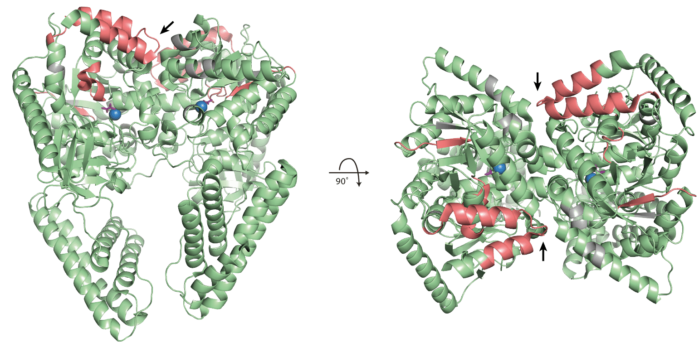
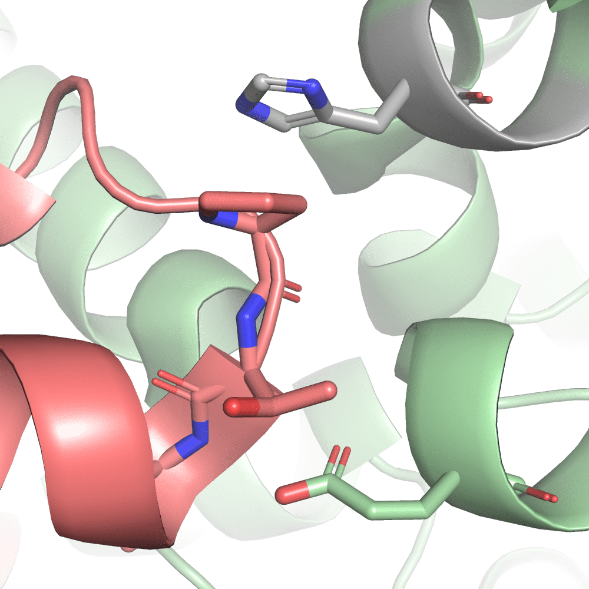
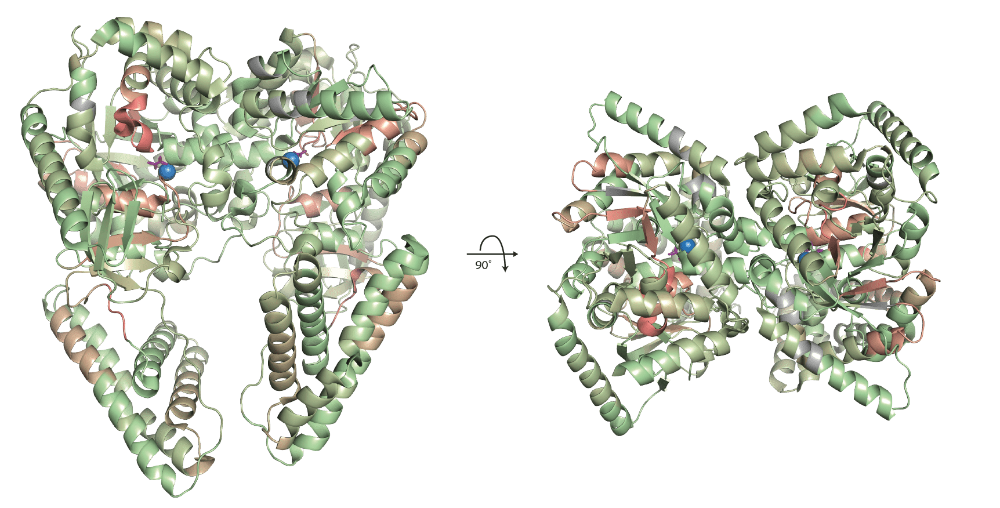
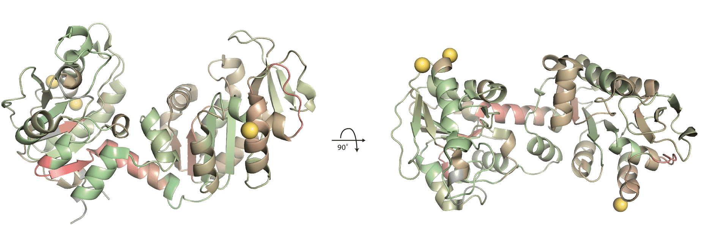

<style>
body {
text-align: justify}
</style>

```{r, include = FALSE}
build_vignette_on_cran <- identical(Sys.getenv("BUILD_VIGNETTE"), "true")
test_protti <- identical(Sys.getenv("TEST_PROTTI"), "true") & build_vignette_on_cran
knitr::opts_chunk$set(
  collapse = TRUE,
  comment = "#>",
  out.width = "100%"
)
```

# Introduction

```{r CRAN_comment, message=FALSE, warning=FALSE, echo=FALSE}
if (build_vignette_on_cran == FALSE){
  print("!!! IMPORTANT !!!")
  print("This Vignette has not been built completely on CRAN due to size limitations.")
  print("Please check the correct version here: ")
  print("https://jpquast.github.io/protti/articles/protein_structure_workflow.html")
}
```

This vignette will take you through all important tools **protti** provides for structural data analysis. These include functions that allow you to fetch information about protein structures both on an experimental as well as structural level. Additionally, structure contact maps can be created from distances between atoms. Lastly, B-factors* of structures can be manipulated to contain custom values. This gives you the ability to colour regions on structures as well as to apply continuous values associated with each amino acid as a colour gradient using biomolecular visualisation software such as PyMOL or ChimeraX or the R package `r3dmol`. 

_\*B-factors or temperature factors are used in structural biology to describe the atomic displacement in the structure. In low resolution structures they might correspond to the flexibility of regions, while in high resolution structures they should not be used to infer information regarding flexibility._

In structural proteomics, protein structural changes can be determined using methods such as limited proteolysis coupled to mass spectrometry ([LiP-MS](https://www.nature.com/articles/nbt.2999)), cross-linking mass spectrometry ([XL-MS](https://pubmed.ncbi.nlm.nih.gov/29160693/)) and hydrogen/deuterium exchange mass spectrometry ([HDX-MS](https://pubs.rsc.org/en/content/articlelanding/2011/CS/C0CS00113A)). In case of LiP-MS, structural changes can be identified with peptide or precursor* centric proteomics in the form of peptide or precursor fold changes. Relating this information to positions within the 3D space of a protein can be very helpful to infer potential functional roles of those structural changes. If structural changes occur close to the active site of an enzyme, kinetics might be affected, if they occur at a protein-protein binding interface, the corresponding protein complex might have dissociated or assembled. 

_\*Peptide precursors are the different charge states of a peptide (+/- modifications) and the actual molecular unit that is detected in the mass spectrometer._

## Structural data

The world wide Protein Data Bank (wwPDB) manages and archives information about the 3D structure of proteins. Its information can be accessed through several websites such as the Research Collaboratory for Structural Bioinformatics ([RCSB](https://www.rcsb.org)). 

When working with structure files it is important to keep a few things in mind such that mistakes can be avoided. One aspect to consider is that protein structure files come in two mainly used formats, namely the PDB file format (.pdb) and the mmCIF file format (.cif). The PDB file format is the legacy file format of the Protein Data Bank, which has been replaced with the newer mmCIF file format that stores data on biological macromolecules. All structures available in the Protein Data Bank are available as a mmCIF file, while not all are available as a PDB file. Mainly large protein complexes only contain mmCIF files. 

The way both files store data and relate to each other can be quite complex. There are several resources explaining their [relation](https://mmcif.wwpdb.org/docs/pdb_to_pdbx_correspondences.html) and their [content](https://mmcif.wwpdb.org/docs/pubs/AUTHOR_ch4o5.pdf). The most important thing to know about these files for you as a user of **protti** is the fact that there are different naming conventions for elements of the structure. 

PDB files solely use the naming provided by the author of the structure in order to match the identification used in the publication that describes the structure. Columns containing author information start with the prefix "`auth_`". This includes the naming of chains (`asym_id`), atom IDs (`atom_id`) and residue IDs (`seq_id`). 

mmCIF files use both the naming provided by the author and a naming following the standardised conventions for mmCIF files. Columns containing standardised information start with the prefix "`label_`". 

_**Additional information:** The differences between author provided and standardised labeling may vary a lot depending on the structure and can be quite confusing. An example taken from the [documentation](https://mmcif.wwpdb.org/docs/pubs/AUTHOR_ch4o5.pdf) of mmCIF files describes the relationship between author provided and standardised residue IDs as follows: The `label_seq_id` (standardised residue ID) column is required to be a sequential list of positive integers, while the `auth_seq_id` (author residue ID) is not necessarily a number and the values do not have to be positive. The author may assign values to `auth_seq_id` in any desired way. For instance, the values may be used to relate this structure to a numbering scheme in a homologous structure, including sequence gaps or insertion codes. Alternatively, a scheme may be used for a truncated polymer that maintains the numbering scheme of the full length polymer. In all cases, the scheme used here must match the scheme used in the publication that describes the structure._

For the use of the functions in **protti** it is important to know that these two different conventions exist. **All functions usually take the author provided information as inputs.** This has the reason that even though the PDB file format is a legacy format, many people still mainly use this format. With the `find_peptide_in_structure()` function we provide a convenient way for you to find both the standardised and the author provided residue numberings for a peptide, protein region or amino acid, returning their UniProt start and end position. In addition, we return the full stretch of residue annotations for the author provided information in the column `auth_seq_id` since they are not necessarily consecutive as previously mentioned.

# Getting started

Before starting the structural analysis of your data you need to load **protti** and additional packages used for the analysis. As described on the [main page](https://jpquast.github.io/protti/index.html) of **protti**, the [tidyverse](https://www.tidyverse.org) package collection works well together with the rest of the package, by design. You can load packages with the `library()` function.

```{r load_packages, eval = test_protti, warning = FALSE, message = FALSE}
# Load packages
library(protti)
library(dplyr)
library(magrittr)
library(stringr)
library(tidyr)
library(ggplot2)
```

We will demonstrate the use of **protti**'s structure analysis functions based on a data set of peptides that were significantly changing in a LiP-MS experiment and thus point towards a structural change in the protein. 

The functions used in this analysis can also be used in a different context than a structural proteomics experiment. Instead of peptides you can investigate the positioning of individual amino acids, or whole domains within a protein. 

## Loading data

For this vignette we use a subset of two proteins from separate LiP-MS experiments that contain peptides significantly changing in abundance due to a structural change. We combined these two proteins into one data set to showcase that multiple proteins and structures can be analysed at once. The data was obtained from the paper "Dynamic 3D proteomes reveal protein functional alterations at high resolution in situ" ([Cappelletti 2021](https://doi.org/10.1016/j.cell.2020.12.021)). Both experiments were conducted on purified _E. coli_ proteins spiked into _E. coli_ lysates. The first protein is phosphoglycerate kinase 1 (pgk) which was treated with 25 mM 3-phosphoglyceric acid (3PG). The second protein is phosphoenolpyruvate-protein phosphotransferase (ptsI) which was treated with 25 mM fructose 1,6-bisphosphatase (FBP). 

Based on structural changes observed in these proteins the authors conclude that FBP binds to the active site of ptsI and acts as a competitive inhibitor, which is confirmed by an activity assay. The structural change in pgk caused by 3PG is likely representative of substrate occupancy and correlates with metabolic flux changes.

The example data is included in **protti** and you can easily use it by calling the `data()` function. This will load the data into your R session.

```{r load_data, eval = test_protti, warning = FALSE}
utils::data("ptsi_pgk")
```

If you want to read your own data into R, we suggest using the `read_protti()` function. This function is a wrapper around the fast `fread()` function from the [`data.table`](https://rdatatable.gitlab.io/data.table/) package and the `clean_names()` function from the [`janitor`](http://sfirke.github.io/janitor/) package. This will allow you to not only load your data into R very fast, but also to clean up the column names into lower snake case. This will make it easier to remember them and to use them in your data analysis. Usually you would perform the following analysis after the analyses described in either the [vignette for single dose treatments](https://jpquast.github.io/protti/articles/data_analysis_single_dose_treatment_workflow.html) or the [vignette for dose response data](https://jpquast.github.io/protti/articles/data_analysis_dose_response_workflow.html).

```{r use_read_protti, eval=FALSE}
# Load data
your_data <- read_protti("your_differential_abundance_data.csv")
```

## Preparing data

First we need to annotate the data with information required for structural data analysis. To find peptides in a protein structure we need to know their positions in the protein first. For this we can use the **protti** function `find_peptide()`. This function searches for the peptide within the protein sequence, which we need to fetch from UniProt. For this we can use the **protti** function `fetch_uniprot()`. In addition to the protein sequence we will also need information about PDB identifiers associated with the protein, which can also be accessed via UniProt.

```{r prepare_data, eval = test_protti, warning = FALSE}
# Input UniProt IDs
uniprot_ids <- unique(ptsi_pgk$pg_protein_accessions)

# Fetch UniProt information
uniprot_information <- fetch_uniprot(uniprot_ids = uniprot_ids,
                                     columns = c("sequence", "xref_pdb"))

# Add UniProt information and find peptide positions
ptsi_pgk_annotated <- ptsi_pgk %>% 
  left_join(uniprot_information, by = c("pg_protein_accessions" = "accession")) %>% 
  find_peptide(protein_sequence = sequence, peptide_sequence = pep_stripped_sequence)
```

# Fetching structural information 

You can access structural information with **protti** in order to see if there are protein structures available for your protein, how they were acquired and if they fit your quality requirements. 

In the previous step we already retrieved information about the availability of protein structures for your protein of interest using the `fetch_uniprot()` function. The column `xref_pdb` contains PDB identifiers if there is a structure available. Since the identifiers are pasted together into one string we need to separate them into individual identifiers to provide them to the `fetch_pdb()` function. This can be achieved through a combination of the `stringr` function `str_split()` and the `tidyr` function `unnest()`.

```{r extract_pdb_info, eval = test_protti, warning = FALSE}
# Extract PDB IDs from UniProt information
ptsi_pgk_pdb_ids <- ptsi_pgk_annotated %>% 
  distinct(pg_protein_accessions, xref_pdb) %>% 
  mutate(pdb_id = str_split(xref_pdb, pattern = ";")) %>% 
  unnest(pdb_id) %>% 
  filter(pdb_id != "")

# Fetch pdb information
ptsi_pgk_pdb_information <- fetch_pdb(pdb_ids = unique(ptsi_pgk_pdb_ids$pdb_id))
```

The result of `fetch_pdb()` contains a multitude of information. These include for example the experimental method that was used to determine the structure (`experimental_method` and `structure_method`). Depending on the method, there are columns specific to them. For example the column `ph_crystallisation` contains information about the pH of the solution used for crystallisation if X-ray crystallography was used as a method, while the column `ph_nmr` contains equivalent information if the method was NMR. A structure resolution (`resolution_combined`) is for example only included if available, which is not the case for NMR structures.

Generally, the molecular information about the structure is divided into "polymer" and "nonpolymer". While nonpolymer information concerns binding partners such as metal-ions, metabolites, drugs or other small molecules, the polymer information concerns the protein or polynucleotide. 

You could for example only consider structures for your analysis that were determined by X-ray crystallography and that have a resolution of below 3 Å. In addition, you could select only the one structure that contains the longest sequence stretch for each of our proteins (the structure with the maximum `length`). This can be achieved in the following way:

```{r filter_structures, eval = test_protti, warning = FALSE}
filtered_structures <- ptsi_pgk_pdb_information %>% 
  filter(experimental_method == "X-ray",
         resolution_combined <= 3) %>% 
  group_by(reference_database_accession) %>% 
  filter(length == max(length)) %>% 
  ungroup()
```

Generally, you can use the information retrieved by `fetch_pdb()` in any way that fits your specific research question. However, you should note that by using very strict filtering criteria you might remove some of the proteins that actually have structural information. This could be because their structures do not have a high enough resolution or they are not solved using the method of your choice. Filtering by length should also be done with care since for some proteins there might not be any full length structure but two structures of different domains that would make up the whole structural information if used in combination.

## Fetching atomic structural information

In addition to the general structural information that can be retrieved with `fetch_pdb()` you can also access atom level information for each structure using the `fetch_pdb_structure()` function. This information is mainly useful for applications that rely on the coordinates of each atom in the structure. Later in this vignette we will demonstrate how this can be used in the `create_structure_contact_map()` function. Furthermore, `fetch_pdb_structure()` retrieves B-factors for each atom.

Similar to `fetch_pdb()` PDB identifiers are provided as input to `fetch_pdb_structure()`. In the example below we provide the two PDB IDs that were left after the filtering from the previous step was applied to the data. If not too many structures (~<20) are fetched at once it is possible to combine all information in a data frame by setting the `return_data_frame` argument to `TRUE`. This is by default `FALSE`, which will return a list instead with each element representing one structure.

```{r fetch_pdb_structure, eval = test_protti, warning = FALSE}
# Input PDB IDs
pdb_ids <- unique(filtered_structures$pdb_ids) # "1ZMR", "2HWG"

# Fetch atom level structural information
ptsi_pgk_structure_information <- fetch_pdb_structure(pdb_ids = pdb_ids,
                                                      return_data_frame = TRUE)
```

## Fetching atomic structure prediction information from AlphaFold

If a protein does not have any available structure you can alternatively fetch protein structure predictions from [AlphaFold](https://www.nature.com/articles/s41586-021-03819-2) using the `fetch_alphafold_prediction()` function. The function works similar to `fetch_pdb_structure()` but it takes UniProt identifiers instead of PDB identifiers as input. Furthermore, there is the option to fetch all predictions for an organism as a whole. The B-factor information in AlphaFold predictions represents the quality score of the atom position prediction.

It is of course also possible to retrieve structure prediction information for proteins that have a known protein structure. In the example below we will retrieve prediction information for our two proteins ptsi (P08839) and pgk (P0A799). The output column `score_quality` annotates the score from the `prediction_score` column based on the official AlphaFold score quality annotations and cutoffs.

```{r fetch_alphafold_prediction, eval = test_protti, warning = FALSE}
# Fetch atom level structural prediction information from AlphaFold
ptsi_pgk_prediction_information <- fetch_alphafold_prediction(uniprot_ids = uniprot_ids,
                                                              return_data_frame = TRUE)

# Example for fetching all predictions for Methanocaldococcus jannaschii
# mj_predictions <- fetch_alphafold_prediction(organism_name = "Methanocaldococcus jannaschii")
```

## AlphaFold domain predictions using the predicted aligned error (PAE)

AlphaFold predictions come with two kinds of error metrics, the per-residue confidence score (pLDDT) that is saved in the b-factor information of structure files and the predicted aligned error (PAE) that can be downloaded separately from the EBI database. According to the description on the EBI website, the PAE matrix at position (x, y) indicates AlphaFold’s expected position error at residue x, when the predicted and true structures are aligned on residue y. This is useful for assessing inter-domain accuracy. One interesting use case for the PAE is the prediction of domains in AlphaFold predictions. Tristan Croll created a [python script](https://github.com/tristanic/pae_to_domains) that uses a graph-based community clustering algorithm on PAEs in order to infer pseudo-rigid protein domains. These domain predictions can be for example used in order to check the validity of distance calculations between residues of a predicted structure. If residues are on two different domains distances should be used with caution.

With **protti** we provide the function `fetch_alphafold_aligned_error()` that allows you to retrieve the predicted aligned error for AlphaFold predictions directly into your R session. In addition, we adapted the python function from Tristan and created the **protti** function `predict_alphafold_domain()` that predicts protein domains for AlphaFold predictions. In the example below we will retrieve PAEs for our two proteins ptsi (P08839) and pgk (P0A799) and subsequently predict protein domains. The `error_cutoff` argument of the `fetch_alphafold_aligned_error()` function defines the maximum error that should be saved. All higher values will be discarded in order to reduce the size of the returned `list`. For the `predict_alphafold_domain()` function we try out two different `graph_resolution` values which will determine the size of the clusters and thus how strict domains are created.

```{r alphafold_domain_prediction, eval = test_protti, warning = FALSE}
# Fetch aligned errors
aligned_error <- fetch_alphafold_aligned_error(uniprot_ids = uniprot_ids,
                                               error_cutoff = 4)

# Predict protein domains with graph_resolution of 1
af_domains_res_1 <- predict_alphafold_domain(pae_list = aligned_error,
                                       return_data_frame = TRUE,
                                       graph_resolution = 1) # Default 

# Predict protein domains with graph_resolution of 0.5
af_domains_res_05 <- predict_alphafold_domain(pae_list = aligned_error,
                                       return_data_frame = TRUE,
                                       graph_resolution = 0.5)
```

#### ptsI domain prediction with `graph_resolution = 1`

```{r show_model_P08839_res1, eval = test_protti, echo=FALSE, warning=FALSE}
# This code won't be seen in the Vignette
# Fetch structure file for model
protti:::try_query("https://alphafold.ebi.ac.uk/files/AF-P08839-F1-model_v3.pdb",
  type = "text/tab-separated-values",
  col_names = FALSE,
  quote = "",
  show_col_types = FALSE,
  progress = FALSE
) %>%
  readr::write_tsv(
    file = paste0(tempdir(), "/AF-P08839-F1-model_v3.pdb"),
    quote = "none",
    escape = "none",
    col_names = FALSE,
    progress = FALSE
  )

# Load the r3dmol package
library(r3dmol) 

# Extract domain positions

domain1 <- af_domains_res_1 %>% 
  filter(accession == "P08839" & domain == 1) %>%
  pull(residue)

domain2 <- af_domains_res_1 %>% 
  filter(accession == "P08839" & domain == 2) %>%
  pull(residue)

domain3 <- af_domains_res_1 %>% 
  filter(accession == "P08839" & domain == 3) %>%
  pull(residue)

# Create model
r3dmol() %>%
  m_add_model(data = paste0(tempdir(), "/AF-P08839-F1-model_v3.pdb"), format = "pdb") %>% 
  m_set_style(style = m_style_cartoon()) %>%
  m_add_style(
    style = m_style_cartoon(color = "#8047d6"),
    sel = m_sel(resi = domain1)
  ) %>% 
  m_add_style(
    style = m_style_cartoon(color = "#96d647"),
    sel = m_sel(resi = domain2)
  ) %>% 
  m_add_style(
    style = m_style_cartoon(color = "#FF7276"),
    sel = m_sel(resi = domain3)
  ) %>% 
  m_zoom_to()
```

#### ptsI domain prediction with `graph_resolution = 0.5`

```{r show_model_P08839_res05, eval = test_protti, echo=FALSE, warning=FALSE}
# This code won't be seen in the Vignette
# Extract domain positions

domain1 <- af_domains_res_05 %>% 
  filter(accession == "P08839" & domain == 1) %>%
  pull(residue)

domain2 <- af_domains_res_05 %>% 
  filter(accession == "P08839" & domain == 2) %>%
  pull(residue)

domain3 <- af_domains_res_05 %>% 
  filter(accession == "P08839" & domain == 3) %>%
  pull(residue)

# Create model
r3dmol() %>%
  m_add_model(data = paste0(tempdir(), "/AF-P08839-F1-model_v3.pdb"), format = "pdb") %>% 
  m_set_style(style = m_style_cartoon()) %>%
  m_add_style(
    style = m_style_cartoon(color = "#8047d6"),
    sel = m_sel(resi = domain1)
  ) %>% 
  m_add_style(
    style = m_style_cartoon(color = "#96d647"),
    sel = m_sel(resi = domain2)
  ) %>% 
  m_add_style(
    style = m_style_cartoon(color = "#FF7276"),
    sel = m_sel(resi = domain3)
  ) %>% 
  m_zoom_to()
```

# Generation of structural contact maps

A very useful structural analysis function provided by **protti** is `create_structure_contact_map()`, which uses atom level structural information to calculate distances between atoms or amino acid residues. The generated contact map can be used in order to visually assess which regions are in close proximity to each other. Furthermore, you can use this function to identify all atoms that are in a certain proximity to a ligand or other small molecules. Additionally, protein-protein interfaces can be easily identified in structures that contain protein complexes. 

As mentioned in the introduction it is important to find start and end positions of e.g. peptides in a specific structure file based on the UniProt positions. How UniProt and structure positions relate to each other can be extracted from data fetched through `fetch_pdb()`. We provide the convenient `find_peptide_in_structure()` function to actually perform the conversion of UniProt positions to structure specific positions. It either internally uses `fetch_pdb()` to obtain the necessary information or it takes the previously fetched output from `fetch_pdb()` as an input to its `pdb_data` argument. In the latter case it is then also possible to first filter the data to only perform the mapping on relevant structures, which will also speed up the process. 

_Note: If AlphaFold predictions are used for the contact map this step can be skipped and UniProt positions can be used directly since the AlphaFold prediction numbering is based on the UniProt positions._

In the following we are going to identify structure specific peptide start and end positions for our annotated example data (`ptsi_pgk_annotated`). By providing the previously created `filtered_structures` data frame as the input to the `pdb_data` argument, we will only determine the positions of our peptides with regards to the structures contained in the filtered data.

```{r find_peptide, eval = test_protti, warning = FALSE}
ptsi_pgk_peptide_structure_positions <- find_peptide_in_structure(
   peptide_data = ptsi_pgk_annotated,
   peptide = pep_stripped_sequence,
   start = start,
   end = end,
   uniprot_id = pg_protein_accessions,
   pdb_data = filtered_structures,
   retain_columns = c(eg_precursor_id, diff, adj_pval))
```

_Note: The `peptide` argument in this function does not necessarily require the peptide sequence but can also take any other unique peptide identifier as input. This is possible because peptides are not matched to the structure sequence by their sequence but are identified based on their start and end positions in the protein._

Before we calculate the structure contact map we are going to filter our input data to only contain significant peptides. Those are the peptides that meet our cutoff criteria for the fold change (log2(2)) and adjusted p-values (0.01). The contact map will give us an insight into regions that are in close proximity to our significant peptides. In this way we will be able to assess whether significant peptides are in close proximity to each other.

As mentioned previously, there are multiple conventions for positions in structure files. For the `create_structure_contact_map()` function it is important to provide the author defined positions and chain names which are marked with the `auth` prefix. The `distance_cutoff` argument is set to 10 Angstrom and will only keep distances below that value, which will reduce the size of our output. Since contact maps can easily reach a size of several hundred megabytes (per map!) it is advisable to only keep the information strictly required. Another argument that is by default set to `TRUE` is `return_min_residue_distance`. This will return a contact map that contains minimal residue distances instead of atom distances, based on which the map is calculated initially. 

By default contact maps are always created for the provided selection with regards to the whole structure. If you provide an additional data frame to the `data2` argument it is possible to compare your selection provided to the `data` argument to this other subsection. This will reduce the size of contact maps if only a subset of distances should be calculated.

_Note: You can also create contact maps for AlphaFold predictions. In that case you can provide the UniProt ID to the `id` argument._

_Note: If you want to create a contact map of an unpublished or simply downloaded structure that you have the .pdb or .cif file of, you can provide the path to that structure to the `structure_file` argument. In this case the `id` argument should contain a column that only has the content "my_structure"._

_Note: The input to the `create_structure_contact_map()` function can be a data frame containing specific regions (e.g. significant peptides) of a structure that you want to create the contact map for (as explained above and demonstrated below). It is however also possible to create contact maps for certain chains of the structure. In that case you only need to provide the structure ID and chain ID. Furthermore, it is possible to generate a complete contact map of each residue in the structure. In that case you will only need to provide the structure ID. Each of these options will increase the size of your map and also the time it takes to create it. Therefore, you should use these options with caution._

```{r create_structure_contact_map, eval = test_protti, warning = FALSE, fig.width = 10, fig.height = 7, fig.align = "center"}
# Filter data for significant peptides.
significant_peptides <- ptsi_pgk_peptide_structure_positions %>% 
  filter(abs(diff) > 2, adj_pval <= 0.01)

# Create a structure contact maps 
contact_map <- create_structure_contact_map(
  data = significant_peptides,
  id = pdb_ids,
  chain = auth_asym_id,
  auth_seq_id = auth_seq_id,
  distance_cutoff = 10,
  pdb_model_number_selection = c(0, 1),
  return_min_residue_distance = TRUE
)

# This is a helper function for the plot.
# It allows the display of integers on the axis.
integer_breaks <- function(n = 5, ...) {
  fxn <- function(x) {
    breaks <- floor(pretty(x, n, ...))
    names(breaks) <- attr(breaks, "labels")
    breaks
  }
  return(fxn)
}

# Plot structure contact maps
# 1ZMR
contact_map[["1ZMR"]] %>% # Extract data frame from list
  mutate(chain_combinations = paste0("chain_", label_asym_id_var1, "_vs_chain_", label_asym_id_var2)) %>% 
  ggplot(aes(x = label_seq_id_var1, y = label_seq_id_var2, fill = min_distance_residue)) +
  geom_tile() +
  scale_y_continuous(breaks = integer_breaks()) +
  scale_x_continuous(breaks = integer_breaks()) +
  facet_wrap(~chain_combinations, scale = "free") +
  labs(title = "Structure contact map 1ZMR") +
  theme_bw()
  
# 2HWG
contact_map[["2HWG"]] %>% # Extract data frame from list
  mutate(chain_combinations = paste0("chain_", label_asym_id_var1, "_vs_chain_", label_asym_id_var2)) %>% 
  ggplot(aes(x = label_seq_id_var1, y = label_seq_id_var2, fill = min_distance_residue)) +
  geom_tile() +
  scale_y_continuous(breaks = integer_breaks()) +
  scale_x_continuous(breaks = integer_breaks()) +
  labs(title = "Structure contact map 2HWG") +
  facet_wrap(~chain_combinations, scale = "free") +
  theme_bw()
```
The contact map for each structure provided as input will be saved as a separate element of a list, which is returned as the output of the `create_structure_contact_map()` function. These elements can be easily accessed using two square brackets (`[[]]`) right behind the name of the list. The brackets should either contain the name of the element or the index. You can also access each element in the list in a loop using the `map()` function from the `purrr` package.

Contact maps can be plotted using the `ggplot2` package if they are not too large. Contact maps are based on positions of atoms or residues in the structure. While atom IDs are unique, residues are only unique within a certain chain. That means residue position 1 is likely present in each of the chains. To correctly display contact map plots for residues they should be faceted by the unique combinations of chains. If e.g. the x-axis displays residues from chain A and the y-axis residues of chain B this should be displayed in one specific facet. 

_Note: For the plot we recommend using the data base defined chain and residue identifiers in contrast to the author defined ones that were used as input to the `create_structure_contact_map()` function. The reason is that in the data base definitions each molecular entity has their own chain. If a certain protein is for example associated with a metal ion, these might be stored in the same chain in the author defined identifiers but separated into different chains for the data base identifiers. The problem is that in the author defined identifiers the residue numbers might not be consecutive and there could be a large gap in the numbering between the protein and the metal residue._

The two contact maps that were generated based on significant peptides reveal some interesting information about the positioning of the peptides. 

The "1ZMR" structure contains only one protein chain (A). In the contact map of significant peptides that are all located in chain A in relation to all other residues in chain A we can see that even though some of the peptides are quite far apart in the sequence, some are within 10 Angstrom distance in 3D space. Chain B and chain D are a calcium atom, respectively. In case of chain B the atom is actually in close proximity to one of the significant peptides. Chain E stores information about water molecules in the structure. The contact map is not very informative in this case, since the y-axis residue does not indicate any specific relationship of the water molecules with each other. Here it would be interesting to look at the distances of the water molecules to the peptide. If there are no water molecules in close proximity, this might indicate that the peptide is not surface exposed.

The "2HWG" structure contains two protein chains (A and B). Within each protein the significant peptides seem to be in close proximitiy to each other. In this case we can also observe that the peptide located around residue 555 is in close proximity to the other protein chain, which indicates that it might be located within a protein-protein interaction interface. Chain C and E contain a magnesium ion that seems to be in the proximity of two peptides. Chain D and F contain an oxalate ion which is known to inhibit ptsI. The oxalate ion is in very close proximity to to the same peptide that is close to the magnesium ion. This is likely the case because the oxalate ion and magnesium ion are located in the same site. Chain H and G contain water molecules.

# Mapping of amino acids, peptides or regions on 3D protein structures and predictions

Contact maps provide quantitative information about the distances of residues to each other. We can use them to perform further high throughput analysis. In contrast to the rather complex contact map plots it is easier to look at the actual protein structures and the respective peptide positions to get a better overview of the proximity of peptides to each other and in relation to interesting sites. While this analysis is more subjective, it can make certain relationships in the data more obvious.

For the mapping of peptides, protein regions or amino acids on PDB structures or AlphaFold predictions, we provide the `map_peptide_on_structure()` function. Mapping is accomplished based on the replacement of B-factor information in the structure file with peptide specific values. When the structure is coloured by B-factor in PyMOL or ChimeraX, peptides will get highlighted. This function can on the one hand just display categorical information such as if the peptide is significant, present or undetected. On the other hand, continuous information can be displayed such as a score associated with each individual amino acid.

The mapping is performed based on positions and not peptide sequence matching. If you want to perform the mapping onto a PDB structure, you should run the `find_peptide_in_structure()` beforehand to obtain structure specific positions. If you want to map onto an AlphaFold prediction it is not necessary to carry out this step. However, the output of the `find_peptide_in_structure()` function will contain all necessary information to perform also AlphaFold predictions in case there is no available structure file. 

For this function it is important to provide the author defined positions and chain names which are marked with the `auth` prefix. The function performs structural mapping based on this naming convention. 

_Note: If you perform mapping onto an AlphaFold prediction the content of the `pdb_id` provided column should be NA._

_Note: If you want to map peptides to an unpublished or downloaded structure that you have the .pdb or .cif file of, you can provide the path to that structure to the `structure_file` argument. In this case you do not need to provide the `pdb_id` argument. It is very important that your input data frame `peptide_data` only contains information for the protein in the provided structure file and not for other unrelated proteins, otherwise mapping is not performed correctly._

You provide information on colouring through the `map_value` argument. This should contain a numeric column. In the example below we insert the number 100 into this column if a peptide is significantly changing based on our previous cutoff criteria and the value 0 if it is not but was detected in the experiment. In this case you could simply insert any two numbers. However, the first number that colours your positive hits should be higher. The function will internally scale these values between 50 and 100. In this case 0 would become 50 and 100 stays 100. All regions of the structure that were not covered by any of you peptides receive the final value 0. This allows us to distinguish between covered (50-100) and non-covered (0) regions as well as covered non-significant (50) and significant regions (100). This is especially helpful if peptides are coloured according to a continuous score (see later in this vignette).

Lastly, we can specify an export location to indicate a place where the structure file should be saved. In this example the location is specified as a temporary file directory using the `tempdir()` function. You should change that location to any more accessible place. If you leave the argument empty, structures will be automatically saved in your working directory.

```{r peptide_mapping, eval = test_protti, warning = FALSE}
ptsi_pgk_peptide_structure_positions %>% 
  mutate(map_value = ifelse(eg_precursor_id %in% significant_peptides$eg_precursor_id, 
                            100, 
                            0)) %>% 
  map_peptides_on_structure(
   uniprot_id = pg_protein_accessions,
   pdb_id = pdb_ids,
   chain = auth_asym_id,
   auth_seq_id = auth_seq_id,
   map_value = map_value,
   file_format = ".pdb", 
   export_location = tempdir() # change to a location of your choice
 )
```

The function does not return anything in the R environment. Structures are directly saved in the desired format. The files contain the name of the structure and separated by "_" the name of all UniProt IDs present in the structure file.

To visualise coloured regions in your proteins you should open the file in either PyMOL or ChimeraX. There you have the option to colour structures by B-factor. Alternatively, we present an option within R using the `r3dmol` package to interactively display structures with the help of htmlwidgets.

### 3D structure mapping in R using r3dmol

It is possible to use the [`r3dmol`](https://swsoyee.github.io/r3dmol/index.html) package to visualize protein structures directly in R. The package is still under development and provides support for [`3Dmol.js`](https://3dmol.csb.pitt.edu/index.html). You can find extensive documentation and examples on their GitHub page. Below we provide a specific example of how to use the package in order to visualise structures created by `map_peptides_on_structure()` in R colouring by B-factors. Later we provide an example of how to use a colour gradient. In fact the same function that is used later can also be used in this case.

If you run the code snippets on your own make sure you replace `paste0(tempdir(), "/1ZMR_P0A799.pdb")` with the location and file you want to visualise.

`r3dmol` facilitates direct interaction with the structure if this vignette is exported as an html document. You can for example zoom, rotate or move the structure.

```{r 3d_structure_mapping, eval = test_protti, echo=TRUE, warning=FALSE}
# Install the r3dmol package if it is not installed
# install.packages("r3dmol")

# Load the r3dmol package
library(r3dmol) 

# Create structure
r3dmol() %>%
  m_add_model(data = paste0(tempdir(), "/1ZMR_P0A799.pdb"), format = "pdb") %>% 
  m_set_style(style = m_style_cartoon(
    colorfunc = "
        function(atom) {
          if (atom.b == 50) {return '#90EE90'};
          if (atom.b == 100) {return '#FF7276'};
          if (atom.b == 0) {return 'white'};
          return 'white';
        }"
  )) %>%
  m_zoom_to()
```

### PyMOL

The following command colours structures by B-factor. You can specify a gradient with predefined or custom colours separating them by underscores. The gradient can also contain more than 3 different colour steps. The minimum and maximum values of the gradient should also be specified. These are based on the previously mentioned scaling. In the below gradient all non-covered regions will be gray. Covered by non-significant regions will be "palegreen" and signficiant regions will be "deepsalmon".

```
spectrum b, gray70_palegreen_deepsalmon, minimum = 0, maximum = 100
```

Custom colours can be defined with the following command and subsequently used in the command above.

_Note: Custom names should not contain underscores since this confuses PyMOL when the gradient function is used._

```
set_color cpink, [235, 52, 189]
set_color cblue, [52, 171, 235]
```

### ChimeraX

In Chimera you have similar options like in PyMOL for colouring structures by B-factors. You can use the command below to create a colour gradient over the structure.

```
color bfactor palette darkgrey:darkseagreen:salmon
```

If you only want to colour proteins by B-factors while leaving other entities such as nucleic acids or small molecules in their default colour you can use the following command instead.

```
color byattribute bfactor protein palette darkgrey:darkseagreen:salmon
```

## Result

The figures below are the results of performing the colouring steps on the two structures of ptsI and pgk with significantly changing peptides highlighted in red. Areas in gray were not covered by any detected peptides.

For ptsI which was treated with fructose 1,6-bisphosphatase (FBP) the significantly changing peptides are all located in the same region of the protein. They are in close proximity to the active site that contains the magnesium atom coloured in blue and the oxalate ion coloured in purple. The contact maps showed a significant peptide in close proximity to the protein-protein interaction surface of the homodimer. This peptide is indicated by black arrows. It is not buried in the binding site but rather located at the edge of it. Its residues are, however, directly participating in the formation of the interaction surface through hydrogen bonds and likely a pi-pi stacking between a proline and histidine residue. The fact that there are no significant peptides buried in the interaction surface likely indicates that the complex does not dissociate into its subunits upon FBP treatment. It is more likely that FBP treatment induces a general structural change observable in the vicinity of the active site due to its likely binding to this site. This observation is also in line with the fact that FBP is an inhibitor of ptsI ([Cappelletti 2021](https://pubmed.ncbi.nlm.nih.gov/33357446/)).

```{r peptide_map_2hwg, eval = test_protti, echo = FALSE, fig.align = "center", fig.cap = "**ptsI (2HWG) with mapped significantly changing peptides.**"}

```

```{r interaction_2hwg, eval = test_protti, echo = FALSE, fig.align = "center", out.width = "60%", fig.cap = "**ptsI (2HWG) binding interface of significantly chaging peptide.**"}

```

Mapping of significantly changing peptides onto the pgk structure reveals that most of the protein seems to be structurally affected by the treatment with 3-phosphoglyceric acid (3PG). Based on UniProt annotations and the similarity of the protein to its homologues in other organisms, the 3PG binding site is located on the left side indicated with a black arrow. None of the residues involved in the interaction with 3PG are found in a significantly changing peptide. Due to the compact size of the protein and the even distribution of significant peptides it is hard to draw any conclusions about potential structural effects of the treatment.

```{r peptide_map_1zmr, eval = test_protti, echo = FALSE, fig.align = "center", fig.cap = "**pgk (1ZMR) with mapped significantly changing peptides.**"}
knitr::include_graphics("figures/peptide_map_1zmr.png")
```

## Mapping of amino acid scores

In order to narrow down and prioritize structurally affected protein regions, we have developed the amino acid scoring function `calculate_aa_scores()`. For each amino acid position in the protein the function calculates the average product of the -log10(adjusted p-value) and the absolute log2(fold change) per peptide, covering the amino acid position. In other words, the information of all the peptides in a specific region is integrated, which strengthens the confidence of a structural change being true since false positive peptides are averaged out. One downside of this approach is that it relies on very good sequence coverage since otherwise false positive peptides with high scores that solely cover a specific region are not distinguishable from real hits. In our example we are lucky that both proteins have a very high coverage.

To map the amino acid scores, the amino acid positions within the protein structure need to be correctly assigned first using `find_peptide_in_structure()`, with the `residue` column as input for `peptide`, the `start` and the `end` position. This step is required after the amino acid score calculation, since `calculate_aa_score()` needs a numeric input for start and end positions, and therefore, `auth_seq_id` (a character column) cannot be used as an input.

The `map_peptides_on_structure()` function is capable of mapping continuous values to a structure. In this case values are again scaled between 50 and 100. It is likely that values fall in between 50 and 100 which is displayed as a colour gradient step in between the colour in the middle of the gradient (50) and the colour at the end of the gradient (100). 

**Important: If you run this Vignette locally, make sure to save the structures generated next in a different folder than the previous ones. Otherwise the last structures will be overwritten.**

_Note: If multiple structures are mapped at the same time, by default each structure scales its map values between 50 and 100 based on its minimum and maximum score. It is also possible to use one scale for all structures that are mapped if the `scale_per_structure` argument of the `map_peptides_on_structure()` function is set to `FALSE`. In this case only one of the structures (the one containing the highest score) will have the 100 value. The highest score of the other structures will be lower than 100. This means that the scale of colours between both structures is comparable._

```{r calculate_and_map_scores, eval = test_protti}
# Calculate the amino acid score
amino_acid_score <- calculate_aa_scores(
  data = ptsi_pgk_peptide_structure_positions,
  protein = pg_protein_accessions,
  diff = diff,
  adj_pval = adj_pval,
  start_position = start,
  end_position = end,
  retain_columns = c(pdb_ids, auth_asym_id)
)

# Find amino acid positions in the structure
ptsi_pgk_amino_acid_structure_positions <- find_peptide_in_structure(
   peptide_data = amino_acid_score,
   peptide = residue,
   start = residue,
   end = residue,
   uniprot_id = pg_protein_accessions,
   pdb_data = filtered_structures,
   retain_columns = c(amino_acid_score))

# Map the score on structure
map_peptides_on_structure(
  peptide_data = ptsi_pgk_amino_acid_structure_positions,
   uniprot_id = pg_protein_accessions,
   pdb_id = pdb_ids,
   chain = auth_asym_id,
   auth_seq_id = auth_seq_id,
   map_value = amino_acid_score,
   file_format = ".pdb",
   export_location = tempdir()
 )
```

While the previous method of displaying only significantly changing peptides that have a minimum fold change is useful for the identification of regions that change the most, it is not resistant to false positive peptides. The score on the other hand will only be high if an amino acid is consistently part of significant and differentially abundant peptides. The problem of the score is that it is hard and visually even impossible to interpret what a certain score means. This is due to the fact that the same score can be caused by two completely different scenarios. On the one hand an amino acid might be associated with peptides that have a low fold change but are highly significant. On the other hand it can be associated with peptides that have a high fold change but are of low significance. Both scenarios could yield the same amino acid score. Therefore, the score should not be misinterpreted as describing the extent of the change but should rather be seen as a probability that a certain amino acid is really structurally affected.

You can visualise the score as a colour gradient using the `r3dmol` package in R. For that you need to first create a gradient using the `colorRampPalette()` function, which creates a function capable of creating a colour gradient over the specified colours. Instead of providing only three colours to this function you can provide additional colours to make a gradient with multiple substeps. It is important to always use 101 colours to get the full range for the structure. The colour gradient needs to be concatenated using `paste0()` and provided to the `colorfunc` argument within the shown javascript function context. 

```{r score_3d_structure_mapping, eval = test_protti, echo=TRUE, warning=FALSE}
# create a color gradient with 101 colors
color_gradient <- paste0('"', 
                         paste(colorRampPalette(c("white", "#90EE90", "#FF7276"))(101), 
                               collapse = '", "'), 
                         '"')

# create structure
r3dmol() %>%
  m_add_model(data = paste0(tempdir(), "/2HWG_P08839.pdb"), format = "pdb") %>%
  m_set_style(style = m_style_cartoon(
    colorfunc = paste0("
        function(atom) {
          const color = [", color_gradient,"]
          return color[Math.round(atom.b)]
        }")
  )) %>%
  m_zoom_to()
```

Applying the score to both structures refines the region that is most robustly affected by the treatment. For ptsI it seems that a region of amino acids directly in the active center are consistently affected. In addition we see a small region below, which was previously not seen due to its low fold changes that did not meet the cutoff. The score tells us that this region is indeed consistently affected and that there is likely a structural change occurring even though the fold change of peptides is rather low. The region in the binding interface previously indicated with a black arrow is now not highlighted anymore, indicating that this was likely a false positive hit and that other peptides in the same region do not exhibit a strong and significant response.

```{r peptide_map_2hwg_score, eval = test_protti, echo = FALSE, fig.align = "center", fig.cap = "**ptsI (2HWG) with mapped amino acid scores.**"}

```

For ptg we see that the most robustly changing region is very close to the binding site of 3PG, which the protein was treated with. In this case, the score helped to refine the binding site of the compound since previously almost the whole protein was covered with significantly changing peptides.

```{r peptide_map_1zmr_score, eval = test_protti, echo = FALSE, fig.align = "center", fig.cap = "**pgk (1ZMR) with mapped amino acid scores.**"}

```

